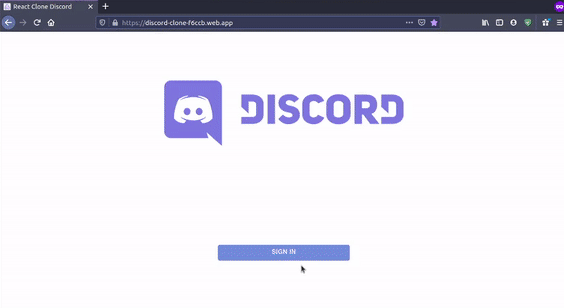

<h3 align="center">
  
</h3>

<p align="center"> 💬 <strong>Realtime Clone Chat Discord</strong> 🚧
 </p>
  
<br>

<p align="center">
   
  
  <a href="https://github.com/savio-2-lopes">
    
  </a>
 
 <a href="https://github.com/savio-2-lopes">
    
  </a>
</p>

<br> 

## :pushpin: Índice

- [Sobre](#sobre-o-projeto)
- [Layout](#layout)
- [Deploy](#deploy)
- [Como Executar](#executar)
- [Tecnologias](#tecnologias)
- [Licença](#licenca)
- [Autor](#autor)

<br>

<a id="sobre-o-projeto"></a>

## 💻 Sobre o projeto

🚀 O projeto é um Clone do Chat do Discord, desenvolvido com ReactJS e a biblioteca Redux. 

<br>

💡 A aplicação é baseada nas lives do canal [Clever Programmer](https://www.youtube.com/channel/UCqrILQNl5Ed9Dz6CGMyvMTQ).

<br>

<a id="deploy"></a>

## ⚡ Deploy

🎲 Segue abaixo o link do Deploy da Aplicação
<br><br>
🔗 [Deploy da Aplicação](https://discord-clone-f6ccb.web.app).

<br>
<a id="layout"></a>

## 🎨 Layout

### Web

<p align="center" style="display: flex; align-items: flex-start; justify-content: center;">
  
</p>

<br>

<a id="executar"></a>

## 🚀 Como executar o projeto

### Pré-requisitos

Antes de começar, você vai precisar ter instalado em sua máquina as seguintes ferramentas:
[Git](https://git-scm.com), [Node.js](https://nodejs.org/en/) e o gerenciador de pacotes [Yarn](https://yarnpkg.com).
Além disto é bom ter um editor para trabalhar com o código como [VSCode](https://code.visualstudio.com/)

<br>

#### 🧭 Rodando a aplicação web

```bash

# Clone este repositório
$ git clone https://github.com/savio-2-lopes/Realtime_Clone_Chat_Discord.git

# Acesse a pasta do projeto no terminal/cmd
$ cd Realtime_Clone_Chat_Discord

# Instale as dependências
$ npm install

# Execute a aplicação em modo de desenvolvimento
$ yarn start

# A aplicação será aberta na porta:3000 - acesse http://localhost:3000

```

<br>

<a id="tecnologias"></a>

## 🛠 Tecnologias

As seguintes ferramentas foram usadas na construção do projeto:

- [Node.js](https://nodejs.org/en/)
- [React](https://reactjs.org)
- [Redux.js](https://redux.js.org)

<br>

<a id="licenca"></a>

## :memo: Licença

Este projeto está sob a licença do MIT. Veja a [página de licença](https://opensource.org/licenses/MIT) para mais detalhes.

<br>

<a id="autor"></a>

## 🦸 Autor
        
[](https://www.linkedin.com/in/savio-lopes/) 
[](https://github.com/savio-2-lopes)
[](https://api.whatsapp.com/send?phone=12996798894&text=Hello!)
[](mailto:savioaugulopes@gmail.com)

Feito com ❤️ por Savio Lopes 👋🏽 [Entre em contato!](https://www.linkedin.com/in/savio-lopes/)
